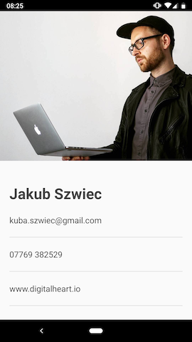
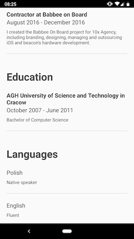

Resume
=========================
The app consists in my own CV. It was created as an Assignment. 

The app is simple, but is ready to scale. It shows a modern approach to developing an Android app using Unidirectional Dataflow Architecture (MvRx) and Jetpack components.

To see how I used to approach similar problems with more traditional MVVM architecture, you can take a look at my other project [Check It, Travel Kit][8]

Screenshots
-----------

Libraries Used
--------------
* [MvRx][0] for Unidirectional Dataflow Architecture.
* [Epoxy][1] for building screens in a RecyclerView.
* [Koin][2] for dependency injection.
* [Retrofit][3] for REST api communication.
* [Moshi][4] for JSON deserialization.
* [Mockito-Kotlin][5] for mocking in tests.
* [Kluent][6] for fluent assertions.
* [Robolectric][7] for painless unit testing resources.

[0]: https://github.com/airbnb/MvRx
[1]: https://github.com/airbnb/epoxy
[2]: https://github.com/InsertKoinIO/koin
[3]: https://github.com/square/retrofit
[4]: https://github.com/square/moshi
[5]: https://github.com/bumptech/glide
[6]: https://github.com/MarkusAmshove/Kluent
[7]: https://github.com/robolectric/robolectric

[8]: https://github.com/qbait/CheckitTravelKit
[9]: https://github.com/qbait/ReplayView/tree/master/app/src/androidTest/java/eu/szwiec/replayview

TODO
-----------------
* Unit tests for Network layer using Mockwebserver as implemented in my other project [Check It, Travel Kit][8]
* Integration tests using Robot pattern as implemented in my other project [Robot Tests for ReplayView][9]
* Add Room Db for caching data and Repository pattern as implemented in my other project [Check It, Travel Kit][8]
